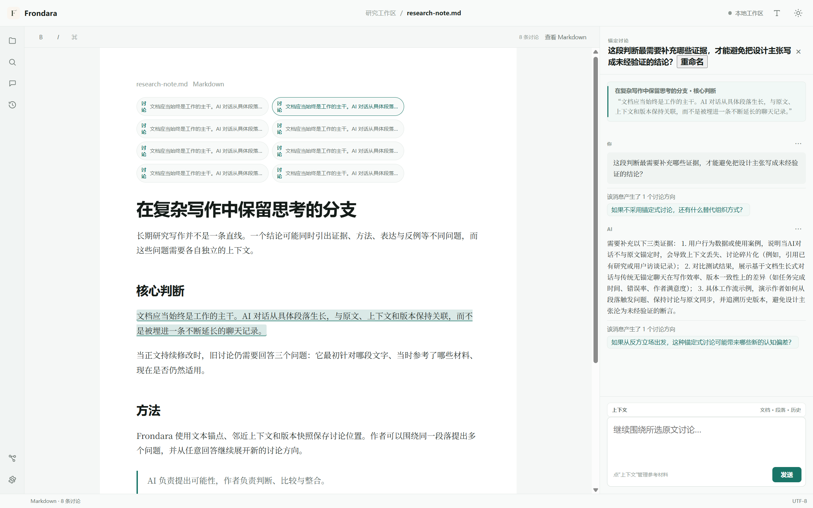
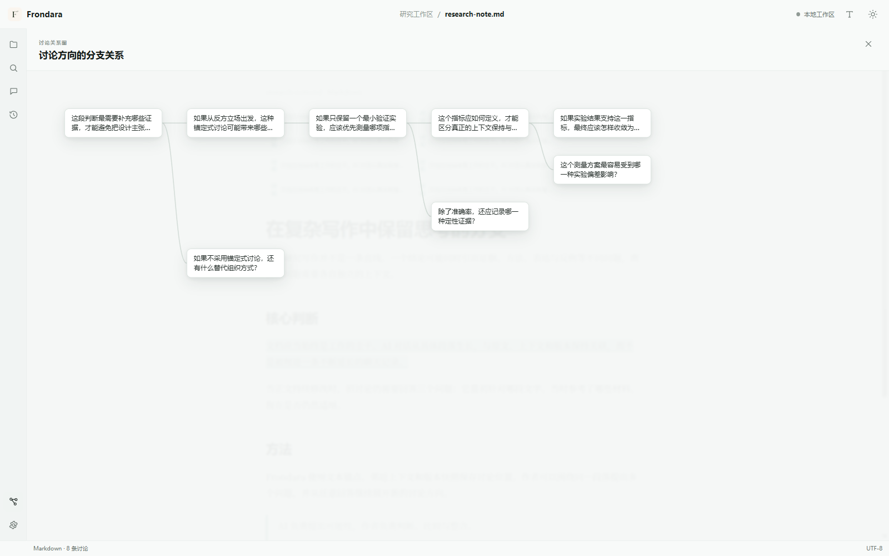
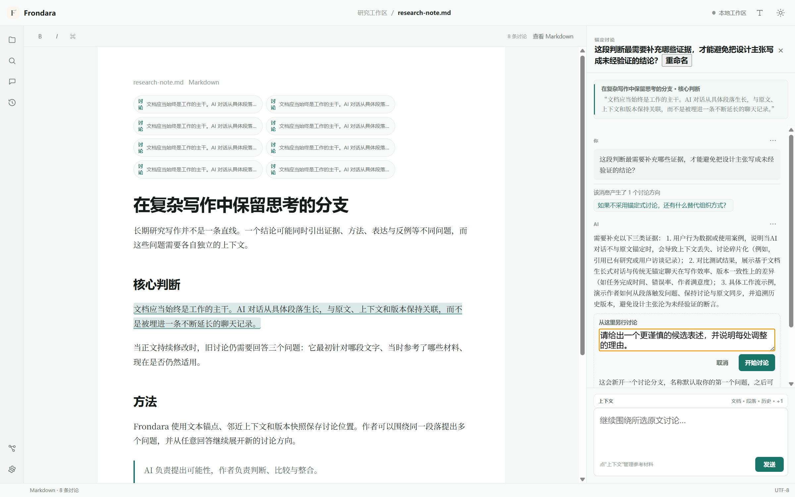
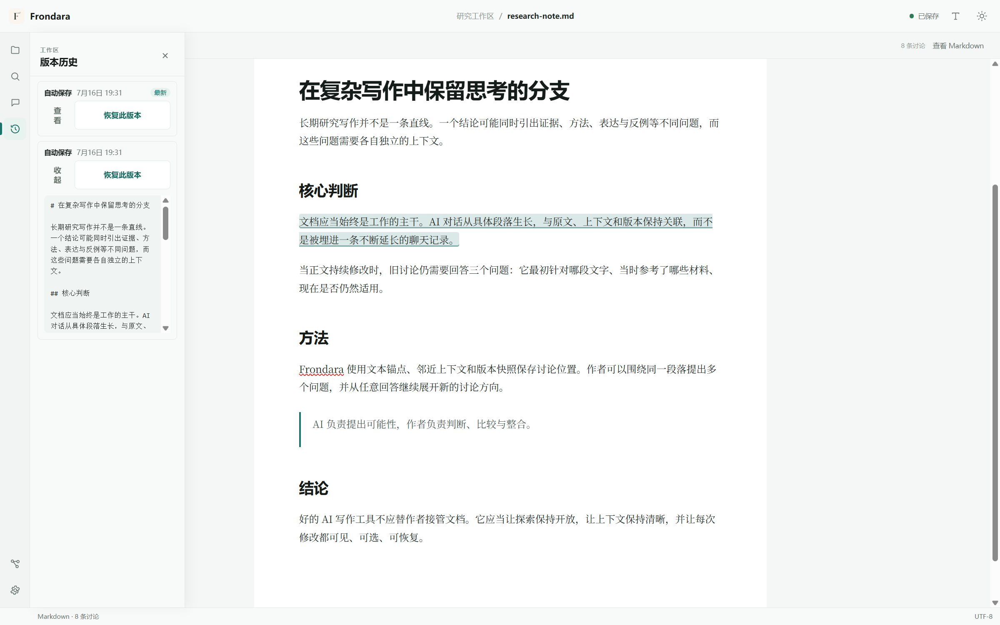
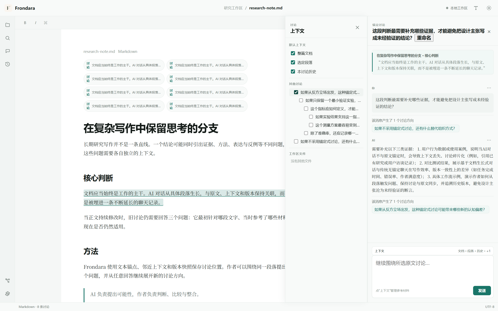

<div align="center">
  
  <h1>Frondara</h1>
  <p><strong>Ideas branch. Context holds.</strong></p>
  <p>
    A <strong><ins>nonlinear</ins></strong> AI workspace for writing and research.<br />
    Turn any meaningful passage in your document into the starting point of an AI discussion.
  </p>
  <p>
    <a href="README.md">简体中文</a>
    &nbsp;&nbsp;·&nbsp;&nbsp;
    <strong>English</strong>
  </p>
  <p>
    <a href="https://github.com/wgl03522-ctrl/Frondara/releases/download/v0.1.1/Frondara-0.1.1-portable.exe"><strong>Download Frondara 0.1.1 · Windows x64 portable</strong></a>
    &nbsp;&nbsp;·&nbsp;&nbsp;
    <a href="https://github.com/wgl03522-ctrl/Frondara/releases/tag/v0.1.1">Release notes</a>
  </p>
</div>

---

Frondara lets you start an AI discussion from any passage in a Markdown document. Ask the AI to challenge an argument, identify missing evidence, propose counterexamples, explore alternatives, or suggest a revision. Every discussion stays connected to the text, context, and document version that gave rise to it.

Frondara is not another chat panel placed beside an editor.

It organizes AI conversations as discussion trees rooted in your documents. Comments become ongoing spaces for inquiry, while Git-inspired versioning makes every proposed change reviewable, comparable, applicable, and reversible.

The document remains the trunk. Ideas may branch, context stays grounded, and the author keeps the final say.

## Product preview

| Paragraph-level AI discussions | Nonlinear discussion branches |
| :---: | :---: |
|  |  |
| **Visible, controllable context** | **Reviewable AI suggestions** |
|  |  |

## Why linear AI chat breaks down in complex writing

A conventional AI chat has one timeline. When you use it to discuss a paper's research question, wording, evidence, methods, limitations, and counterarguments, unrelated problems quickly become entangled.

You end up copying the source text again, restating assumptions, and searching through a growing transcript for decisions made earlier. This creates recurring problems:

- unrelated questions interfere with one another;
- more context does not necessarily mean more relevant context;
- discussions drift away from the passage and version they refer to;
- useful explorations disappear inside long chat histories;
- generated edits can overwrite prose before they are reviewed;
- old discussions lose their meaning as the document changes.

Frondara organizes the conversation from the document itself:

```text
Main document
├── Introduction, paragraph 2
│   ├── Does this claim need a citation?
│   └── How can I reduce the background material?
├── Methods
│   └── Could the sample selection introduce bias?
└── Discussion
    ├── Does this conclusion go beyond the evidence?
    └── What alternative explanations should be considered?
```

Different passages naturally produce different discussions. The same passage can also support several independent questions. A branch appears only when an idea is worth exploring in another direction; it is not extra process, but a faithful representation of complex thinking.

## Core experience

### 1. Nonlinear AI conversations that grow from the document

Select a sentence, paragraph, or section and start a focused discussion from that point. Each discussion knows where it began, which text it refers to, and which context was included when it was created.

You can:

- start an independent AI conversation from any passage;
- ask several separate questions about the same paragraph;
- branch from an earlier message to explore another direction;
- keep unrelated questions contextually isolated;
- inspect the discussion as a tree or graph;
- return to the source passage at any time;
- compare alternative lines of reasoning;
- bring a mature result back into the main document without losing its history.

Most conversations can stay simple and direct. Branching is there when you need to compare hypotheses, formulations, or reasoning paths.

> **Nonlinearity is not about creating complexity. It is about keeping complex work clear.**


### 2. AI discussions that remain anchored to the source

A comment should be more than a static note in the margin. In Frondara, it can become an ongoing AI conversation that records not only what was said, but also:

- which passage the discussion concerns;
- what the passage contained when the discussion began;
- which document context was used;
- which version an AI suggestion was based on;
- how the current document has changed since then.

When the document changes, Frondara uses text anchors, surrounding context, and version snapshots to relocate the discussion. If the new position cannot be established reliably, Frondara asks you to confirm it instead of silently attaching the discussion to the wrong passage.

> **The goal is not merely to preserve the comment, but to preserve a trustworthy relationship between the comment and its source.**


### 3. Context that is visible and controllable

More context is not always better context. Long chat histories accumulate obsolete information, unrelated assumptions, and decisions from other problems.

Frondara treats context as a structure you can inspect and manage. Depending on the task, it may include:

- the selected text;
- the surrounding paragraph or section;
- relevant neighboring passages;
- the current discussion path;
- selected comments or discussions;
- other workspace documents;
- material you explicitly add.

You can add, remove, or replace context instead of allowing every previous exchange to accumulate automatically. This helps the AI focus on the current question, avoid cross-contamination between discussions, and remain grounded as the document evolves.

**Ideas branch. Context holds.** is not only a tagline; it is the central interaction principle. Exploration may stay open, but context must remain deliberate.


### 4. Suggestions instead of silent overwrites

AI can help revise a document, but it should not make final editorial decisions without the author's approval.

Frondara presents generated revisions as candidate suggestions. You can:

- compare the suggestion with the original text;
- ask why a change was proposed;
- request a revision to only part of the suggestion;
- apply a specific sentence or passage;
- apply the entire suggestion;
- keep it as an alternative;
- reject it and leave the document unchanged.

Each accepted suggestion becomes an explicit content change rather than an invisible replacement.

> AI proposes possibilities. The author evaluates and integrates them.


### 5. Git-inspired content management

Complex writing needs reliable version management, but writers should not have to learn software-development workflows to get it.

Frondara borrows the useful ideas behind Git:

- **Versions** preserve meaningful states of the document.
- **Diffs** show exactly what changed between the source and a suggestion.
- **Candidate branches** let you explore alternatives without disturbing the current text.
- **Selective application** lets you accept a word, sentence, paragraph, or complete proposal.
- **Integration** brings a mature result back to the main document while preserving its origin.
- **Restore** returns the document to an earlier state when a revision does not work.
- **Comparison** helps you evaluate several candidate versions side by side.

Frondara offers a Git-inspired writing workflow, not a developer interface transplanted into a writing tool.



## A more natural AI writing workflow

```text
Select a passage
        ↓
Start an anchored AI discussion
        ↓
Question, challenge, or explore alternatives
        ↓
Generate a candidate revision
        ↓
Compare it with the source
        ↓
Apply part, apply all, or keep exploring
        ↓
Preserve the discussion and version history
```

AI participates in a concrete, continuous, and reversible writing process instead of answering outside the document.

## Typical uses

### Audit an argument

Select a conclusion and ask:

> Does this claim go beyond what the current evidence supports?

Frondara can identify hidden assumptions, gaps in evidence, and counterexamples without interfering with discussions elsewhere in the document.

### Simulate peer review

Select a methods or discussion section and ask:

> From the perspective of a strict reviewer, what are the three most likely objections?

Each objection can become an independent branch for sample bias, variable definition, robustness, or alternative interpretation.

### Compare several formulations

Ask the AI for a concise version, a more academic version, a version for general readers, or a revision that preserves the original voice while removing repetition. Compare the candidates before selectively applying any change.

### Explore alternative structures

```text
Current section
├── Organize chronologically
├── Organize by research question
└── Organize by strength of evidence
```

Develop each structure independently, then integrate the strongest result into the main document.

### Preserve long-term research judgment

Research conclusions change as evidence changes. Frondara preserves the reasoning process: what evidence was available, which counterexamples were raised, why the current wording was chosen, and which questions remain unresolved.

## Markdown-native by design

Your research should belong to you, not to a proprietary document database.

Frondara uses Markdown as its core document format:

- files remain readable in any text editor;
- folder structures remain clear and portable;
- documents work naturally with Git, sync tools, and long-term archives;
- content remains searchable and scriptable;
- existing Markdown and Obsidian workflows can continue alongside Frondara;
- your writing remains usable even if you stop using the application.

Discussion relationships, text anchors, version indexes, and interface state are stored as separate metadata rather than being injected into the body of the document.

> **Enhance the document without taking ownership of it.**

## AI providers and privacy

Frondara includes a deterministic demo mode that works without an account or network connection. To use a real model, configure your own OpenAI-compatible API endpoint, model name, and API key in Settings.

- Frondara does not provide a shared cloud AI service.
- Your provider credentials are stored locally.
- Requests go to the endpoint you configure.
- Changing the interface language does not rewrite your documents or force the language of AI responses.

## Interface languages

Frondara 0.1.1 includes complete Chinese and English interfaces. The selected language is stored as a device-level preference, applies across workspaces, and remains active after restarting the application.

## Getting started

1. Download [Frondara 0.1.1 for Windows x64](https://github.com/wgl03522-ctrl/Frondara/releases/download/v0.1.1/Frondara-0.1.1-portable.exe).
2. Launch the portable executable; installation is not required.
3. Open a folder containing Markdown documents.
4. Open **Settings** to choose the interface language and configure an AI provider, or keep using demo mode.
5. Select text in a document and start a discussion.

Frondara stores workspace metadata in a `.pnode` directory inside the selected workspace. Your Markdown files remain ordinary files.

## Build from source

Requirements:

- Node.js and npm
- Windows x64 for the current packaged desktop target

```bash
npm install
npm test
npm run typecheck
npm run build
```

Create the Windows portable package:

```bash
npm run dist -w @pnode/desktop
```

The generated executable is written to `apps/desktop/release/`.

## Who Frondara is for

Frondara is designed for people who work on complex documents over time and want to preserve the reasoning behind them, including:

- researchers, academics, and thesis writers;
- literature-review and research-proposal authors;
- policy, technical, and industry analysts;
- long-form nonfiction writers;
- Markdown and Obsidian users;
- anyone comparing multiple arguments or textual alternatives;
- writers who want explicit control over AI context;
- teams that value an auditable AI-assisted writing process.

It is meant to help you preserve structure, judgment, and control—not merely generate text faster.

## What Frondara is not

### Another general-purpose chat client

The goal is not to manage more chats. It is to keep discussions connected to document structure.

### A one-click article generator

Frondara focuses on specific passages, specific questions, and changes the author can inspect.

### An agent that replaces authorial judgment

AI may suggest, question, and explore, but it does not decide the final text without confirmation.

### A developer tool that requires Git knowledge

Frondara borrows ideas such as versions, diffs, and branches while translating them into writing-oriented interactions.

### A closed document platform

Markdown files remain open, readable, portable, and usable in other tools.

## Roadmap

### Phase 1 — Core interaction

- Markdown editing
- Paragraph-level AI discussions
- Branching from any discussion message
- Tree and graph views
- AI suggestions and diffs
- Basic version history

### Phase 2 — Versioning and application

- Richer document snapshots and comparisons
- Candidate content branches
- Sentence- and paragraph-level selective application
- Stronger merge and restore workflows

### Phase 3 — Knowledge-base integration

- Obsidian vault compatibility
- Wiki Links, backlinks, tags, and Frontmatter
- Cross-document discussion references
- Workspace retrieval as AI context

### Phase 4 — Extension ecosystem

- Extension APIs and developer documentation
- Additional cloud and local model providers
- Reusable prompt workflows
- Zotero and LaTeX integrations

### Phase 5 — Collaboration and sync

- Asynchronous review workflows
- Shared discussions and comments
- Branch merging and conflict handling
- Optional end-to-end encrypted sync

## What we believe

AI should not remain outside the document, nor should it silently rewrite formal text.

A better model is to let conversations grow from specific passages, keep alternative ideas independent, make context visible, and leave final decisions with the author.

- The document is the trunk.
- Passages are starting points.
- Comments are entrances.
- Conversations may branch.
- Context remains controllable.
- Changes remain comparable.
- Results remain selectable.
- The reasoning process remains preserved.

Ideas can keep growing without losing their structure.
